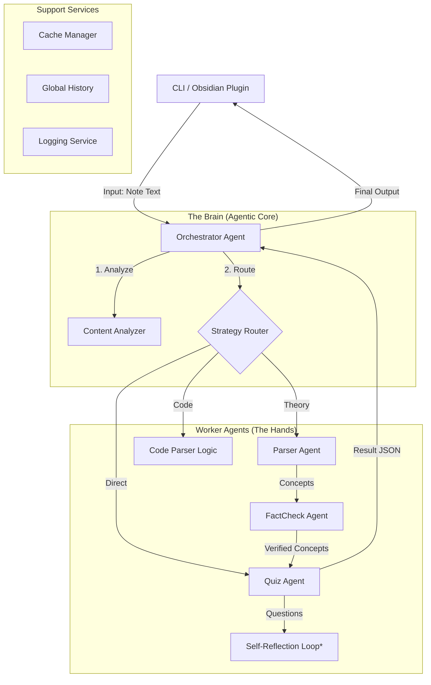

**Ультимативный Архитектурный Документ (MindForge Architecture 2.0)**. Сохраните его как `ARCHITECTURE.md` или `README_DEV.md` в корне проекта.

***

# 🧠 MindForge Architecture v2.0 (Agentic Orchestrator)

## 1. Суть Проекта
**MindForge** — это интеллектуальная система для генерации образовательных квизов (тестов) на основе заметок пользователя (Markdown/Obsidian).
Главная цель: превратить пассивные заметки (лекции, код, статьи) в инструмент активного обучения (Active Recall).

**Ключевое отличие от аналогов:**
Система не просто "скармливает текст LLM". Она использует **Агентную Архитектуру** с этапом глубокого анализа контента. Оркестратор ("Решала") сначала понимает, *что* перед ним (код, теория, мусор), выбирает оптимальную стратегию, и только потом запускает специализированных агентов.

***

## 2. Высокоуровневая Архитектура
Проект построен на базе **Python 3.11+** и использует LLM **GigaChat** (SberDevices).

*\* Self-Reflection Loop — в планах реализации.*

***

## 3. Компоненты Системы (Детально)

### 3.1. OrchestratorAgent (`agents/orchestrator.py`)
**Роль:** "Мозг" и управляющий стейт-машиной.
**Ключевые функции:**
*   **Анализ (`_analyze_content`):** Определяет тип заметки (`THEORY`, `CODE`, `SHORT`, `UNKNOWN`) и сложность.
*   **Роутинг:** Выбирает стратегию (`standard`, `code_practice`, `direct_quiz`).
*   **Fallback-механизм:** Если стратегия `standard` провалилась (парсер вернул 0 концептов), автоматически переключается на `direct_quiz`.
*   **Управление сессией:** Следит за историей вопросов, чтобы не повторяться (Global History).

### 3.2. ParserAgent (`agents/parser.py`)
**Роль:** Структурирование хаоса. Извлекает смысловые единицы.
**Режимы:**
*   `parse_note`: Извлекает термины и определения (`Term: Definition`).
*   `parse_code_note`: Извлекает пары `Term + Code Snippet` для стратегии Code Practice.

### 3.3. QuizAgent (`agents/quiz.py`)
**Роль:** Генератор контента.
**Особенности:**
*   **Умный промптинг:** Использует разные системные промпты для разных стратегий.
*   **Direct Mode:** Может работать напрямую с "сырым" текстом (без концептов).
*   **Code Support:** Умеет вставлять куски кода в поле `code_context` JSON-ответа.
*   **Валидация:** Жестко проверяет структуру JSON, типы вопросов и уникальность (через хеширование текстов).

### 3.4. FactCheckAgent (`agents/factcheck.py`)
**Роль:** Фильтр галлюцинаций.
*   Проверяет извлеченные концепты на достоверность с помощью LLM (без внешнего поиска пока).

### 3.5. ExplainAgent (`agents/explain.py`)
**Роль:** Педагог.
*   Вызывается, когда пользователь ошибается.
*   Генерирует объяснение и мнемоническую технику ("Дворец памяти").

***

## 4. Потоки Данных (Data Flow)

### Стратегия 1: STANDARD (Теория)
1.  **Input:** Длинная лекция.
2.  **Analysis:** Type=`THEORY`.
3.  **Parser:** Извлекает список `[{"term": "...", "definition": "..."}]`.
4.  **FactCheck:** Валидирует список.
5.  **Quiz:** Генерирует вопросы типа "Что такое X?" или "Верно ли, что Y?".

### Стратегия 2: CODE PRACTICE (Код)
1.  **Input:** Сниппет Python с описанием паттерна.
2.  **Analysis:** Type=`CODE`.
3.  **Parser:** Извлекает `[{"term": "Singleton", "code_snippet": "class Singleton..."}]`.
4.  **Quiz:** Генерирует задачи: *"Что выведет этот код?", "Найди ошибку в строке 3"*. Код передается в поле `code_context`.

### Стратегия 3: DIRECT QUIZ (Короткие заметки / Fallback)
1.  **Input:** Короткая заметка или "поток сознания".
2.  **Analysis:** Type=`SHORT` или `Parser` вернул пустоту.
3.  **Parser:** Пропускается.
4.  **Quiz:** Получает сырой текст (`raw_text`) и генерирует вопросы "по смыслу прочитанного".

***

## 5. Технический Стек и Инструменты

*   **Язык:** Python 3.11
*   **LLM:** GigaChat (через `gigachat_client.py` - обертка над API).
*   **Cache:** Локальные JSON-файлы (`data/cache/`).
    *   Имена файлов: `verified_<HASH>.json`.
    *   История: `global_quiz_history.json` (хранит тексты вопросов для дедупликации).
*   **CLI:** `argparse` в `main.py` (флаги `-d`, `-m`, `--ignore-history` и т.д.).
*   **Logging:** Ротация логов (`RotatingFileHandler`), хранятся в `data/logs/`.

## 6. Точки Расширения (Roadmap)

1.  **Feedback Loop (Critic):** Добавить этап проверки сгенерированного квиза перед показом пользователю.
2.  **External Tools:** Дать `FactCheckAgent` доступ к поиску (Wiki/DuckDuckGo).
3.  **Vector DB:** Заменить простой JSON-кэш на ChromaDB для семантического поиска по старым заметкам.

***
*Документ сгенерирован: 4 декабря 2025 г.*

Источники
